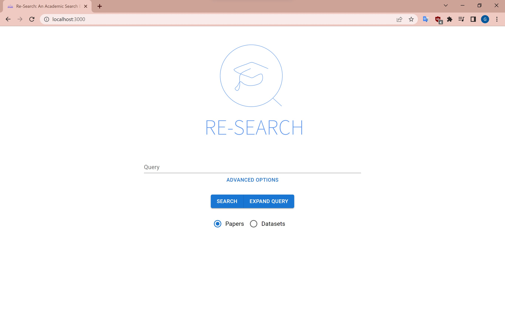

# Re-Search: An Academic Search Engine

Re-Search is an academic search engine made as a coursework for Edinburgh University's Text Technologies for Data Science course. It allows you to search for publicly available datasets and research papers using three different ranking algorithms - TF-IDF, BM25, and ScaNN. It also supports author search (wherever the datapoint allows it), phrase search, and proximity search along with its default search type.

## Screenshot

### Installation instructions:

- Install [npm](https://docs.npmjs.com/downloading-and-installing-node-js-and-npm) and [Python 3.5+](https://www.python.org/downloads/)
- Clone the GitHub Repo.
- Move into the directory: ``cd ttds-cw3``
- Install React and Python dependenices with ``npm install`` and ``pip install -r requirements.txt``
- Run them with ``npm start`` and ``flask run`` respectively.
